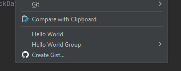
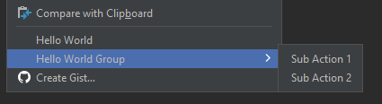

# Intellij Idea Plugin Development Example


## Action

```java
public class HelloWorldAction extends AnAction {
  public HelloWorldAction() {
    super("Hello World");
  }

  @Override
  public void actionPerformed(@NotNull AnActionEvent e) {
    Messages.showInfoMessage("Hello World!", "Info");
  }
}
```
```xml

<actions>
    <action class="com.example.demoplugin.action.HelloWorldAction" id="MyAction">
        <add-to-group group-id="CutCopyPasteGroup"/>
        <add-to-group group-id="EditorPopupMenu"/>
    </action>
</actions>
```




## Action Group


```java
public class HelloWorldActionGroup extends ActionGroup {
  public HelloWorldActionGroup() {
    super("Hello World Group", true);
  }

  @NotNull
  @Override
  public AnAction[] getChildren(@NotNull AnActionEvent e) {
    AnAction subAction1 =
        new AnAction("Sub Action 1") {
          @Override
          public void actionPerformed(@NotNull AnActionEvent e) {
            Messages.showInfoMessage("Sub Action 1!", "Info");
          }
        };

    AnAction subAction2 =
        new AnAction("Sub Action 2") {
          @Override
          public void actionPerformed(@NotNull AnActionEvent e) {
            Messages.showInfoMessage("Sub Action 2!", "Info");
          }
        };

    return new AnAction[] {subAction1, subAction2};
  }

  @Override
  public void actionPerformed(@NotNull AnActionEvent e) {}
}

```

